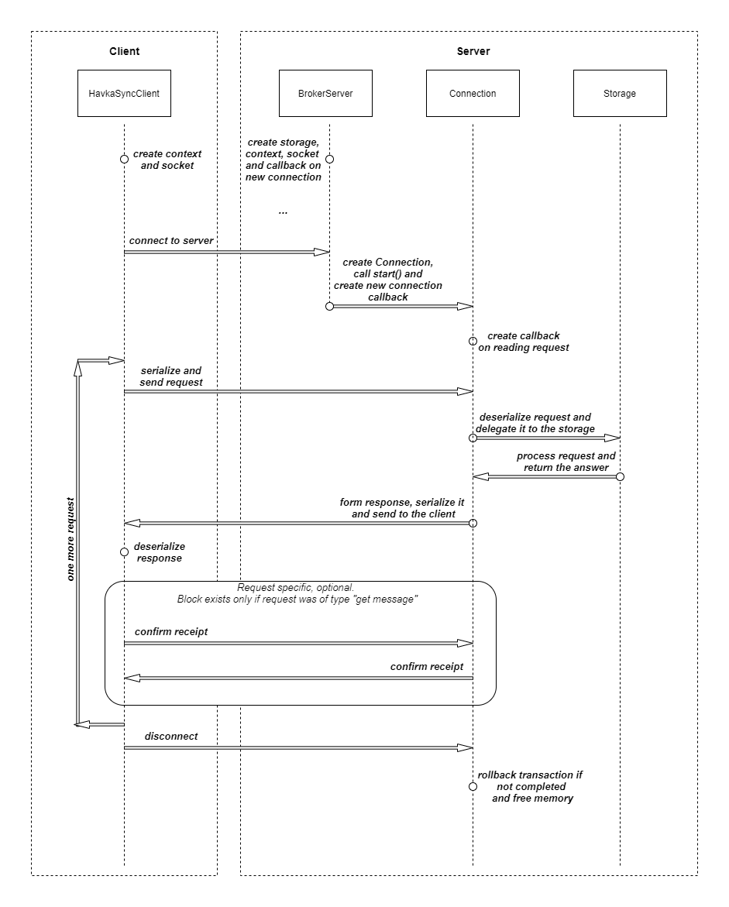
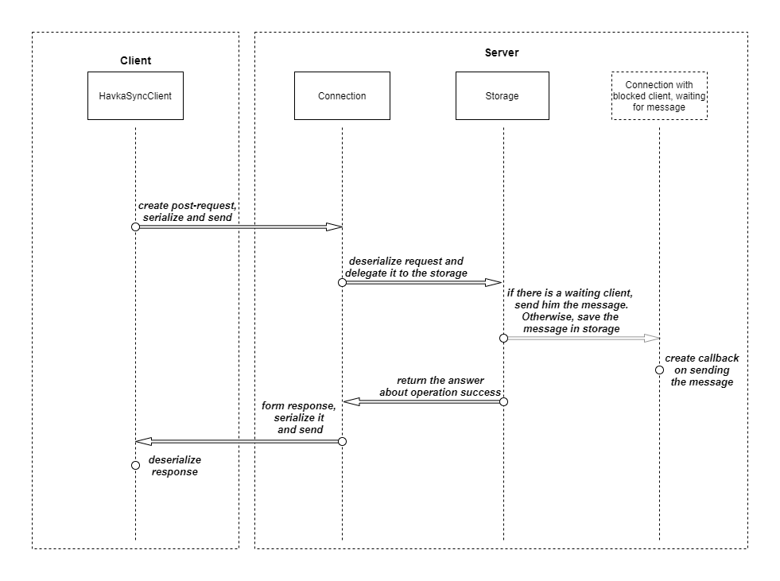
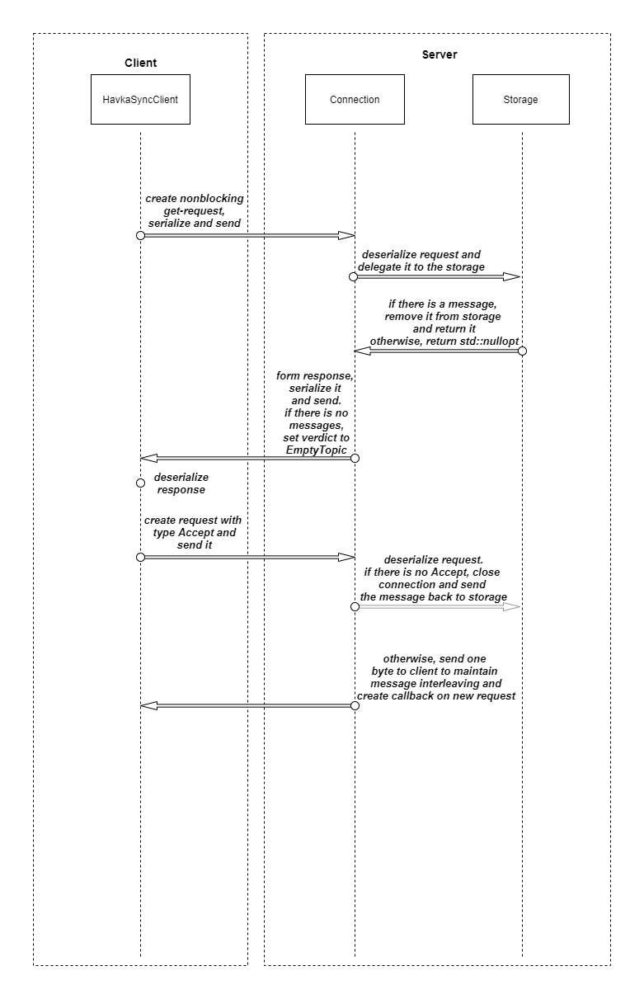
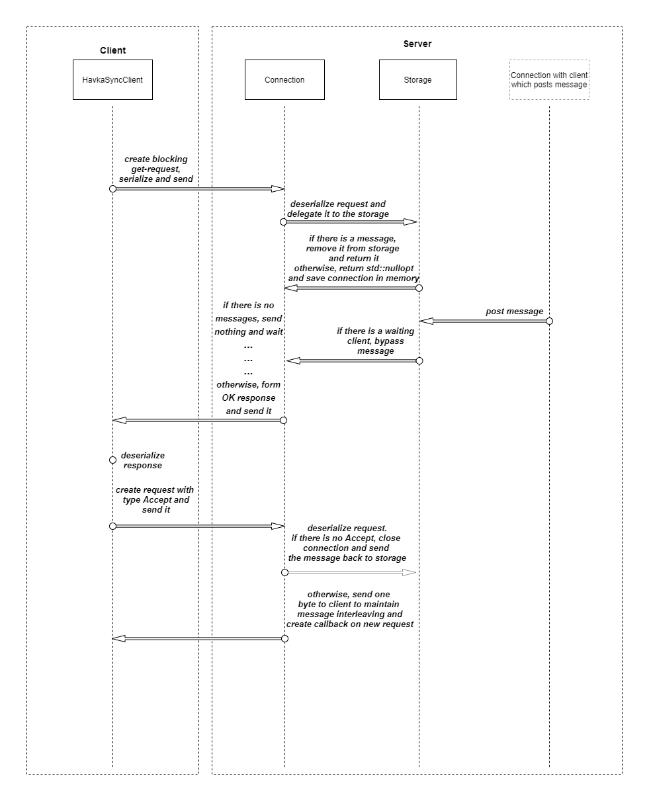

# Havka Message Broker


Message broker (server and client) written in C++. Supports my own messaging protocol
(read below) between C++ server and C++ clients (using my interface)
Needs some libraries (see below). There is a docker for server.

* [Docker](#docker)
* [Dependencies](#dependencies)
* [Build](#build)
* [Configuration](#configuration)
* [Classes usage](#classes-usage)
* [Messaging protocol](#messaging-protocol)
    + [Types](#Request and response types)
    + [RequestType::PostMessageSafe](#RequestType::PostMessageSafe)
    + [RequestType::GetMessageNonblocking](#RequestType::GetMessageNonblocking)
    + [RequestType::GetMessageBlocking](#RequestType::GetMessageBlocking)

## Docker

There is a `Dockerfile` for server, so you can run it in docker. Just change `server_config.yaml`
if you need it and then build and run container.

## Dependencies

Dependencies used:
- `cmake` v3.16.3
- `make` v4.2.1
- `gcc` v9.3.0
- `boost` v1.71.0
- `cereal` v1.3.0
- `yaml-cpp` v0.6.3
- `google-test` v1.11.0

## Build

Make build directory, run cmake and make from it, it is usual.
```shell
mkdir build
cd build
cmake ..
make
```
Now you have `client`, `server` and `test` executables in build directory.

## Configuration

You can use configuration files for client and server.

Example of full config file for server:
```yaml
# Required
endpoint_address: 127.0.0.1
# Required
endpoint_port: 9090

# Storage type used. Now there is only RAM storage
# Being set to ram if absent.
storage_type: ram
# Queues type used. Now there is only queue with mutex
# Being set to mutex if absent.
queue_type: mutex

# Number of threads for server. If -1, being set to maximum.
# Being set to -1 if absent.
threads: -1
# Timeout for server in seconds. If -1, there is no timeout.
# Being set to -1 if absent.
timeout: -1
```

Example of full config file for client:
```yaml
# Required
server_address: 127.0.0.1
# Required
server_port: 9090
```

## Classes usage

You can see usage example in files `server_example.cpp` and `client_example.cpp`.

More precise documentation is in doxygen generated documentation,
[generated doxygen](https://github.com/tsinin/havka-docs),
[website](https://tsinin.github.io/havka-docs/)

You can generate it yourself running from root: `doxygen doxygen.conf`

## Messaging protocol

Current messaging protocol is a superstructure over TCP. Packets are just `havka::Request`
and `havka::Response` structures, packed in binary archive via `cereal` library.
In the future, it is planned to refactor the format for ease of use with other programming languages.

Diagram with main scenario between a server and a client:


### Request and response types

```c++
namespace havka {
    
/// Enum for request type
enum RequestType {
    /// Awaiting the confirmation from broker that
    /// message is posted without errors
    PostMessageSafe,

    /// If queue is empty, wait for message
    GetMessageBlocking,

    /// If queue is empty, return
    GetMessageNonblocking,

    /// Being sent to server after
    /// every get-response (with Message)
    DeliveryConfirmation
};

/// Enum for response type
enum ResponseType {
    /// Post request was successfully processed
    PostSuccess,

    /// Being sent only if posting was safe
    /// (RequestType::PostMessageSafe) and error occured
    ErrorWhilePosting,

    /// Get request was successfully processed
    GetSuccess,

    /// If get-request was blocking, connection is alive and
    /// waiting for a message.
    /// If get-request was non-blocking, std::nullopt is returned
    EmptyTopic,

    /// Unknown error
    Error
};

}   // namespace havka
```

### RequestType::PostMessageSafe



### RequestType::GetMessageNonblocking



### RequestType::GetMessageBlocking


